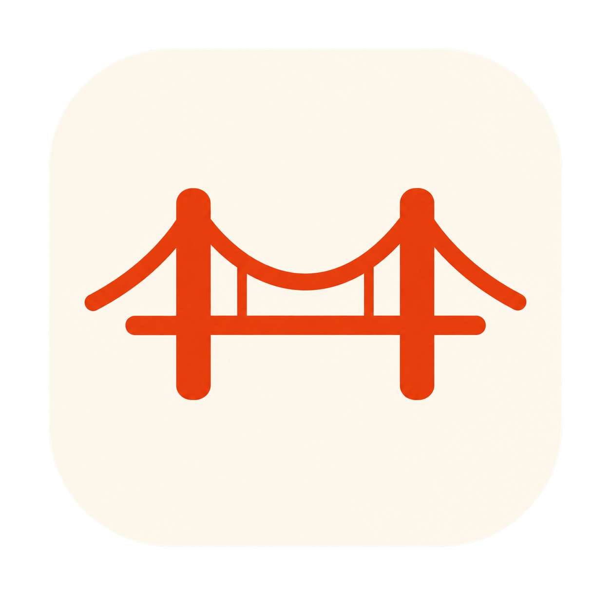
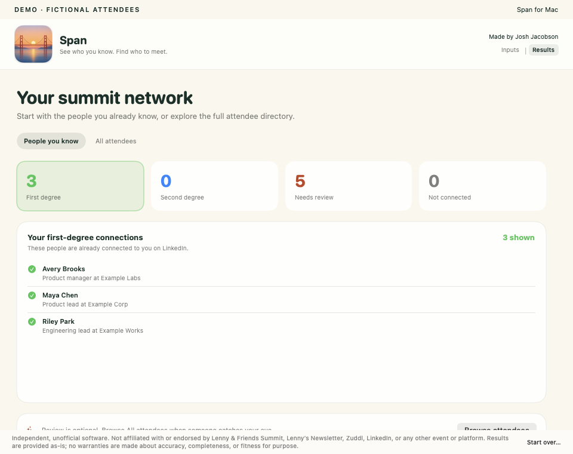
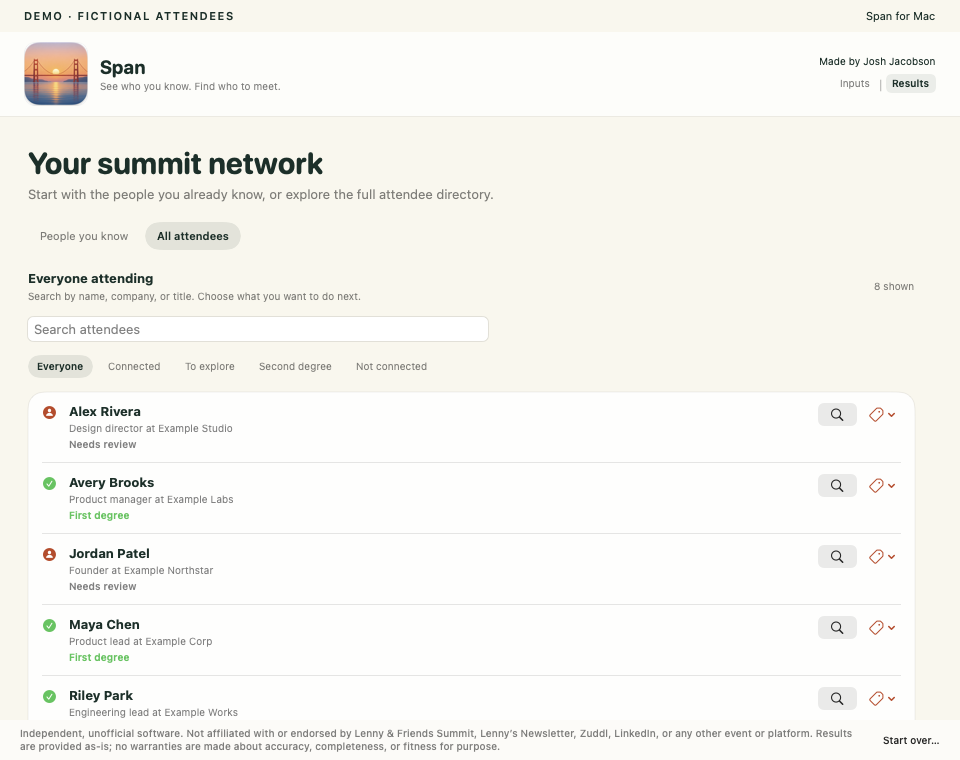

# Span

## Find the people you already know at Lenny & Friends.

Span is a free Mac app that compares the event’s attendee list with your LinkedIn connections export. Find familiar faces, then explore a searchable desktop directory of everyone attending.

Made by [Josh Jacobson](https://www.linkedin.com/in/josh--jacobson/) for fellow attendees. Built with help from OpenAI’s GPT-6 Astra in Codex.

**[Releases and downloads](https://github.com/jmania/span/releases) · [Setup guide](docs/getting-started.md) · [Troubleshooting](docs/troubleshooting.md)**

**Release status:** the source is available now. The signed, Apple-notarized Mac download is being prepared and will appear on the Releases page after installation testing. There is no public installer yet.

## What you get

- **People you know:** find first-degree matches using your LinkedIn connections export.
- **All attendees:** browse and search the collected list by name, company, or title.
- **A next step when someone interests you:** open a pre-filled LinkedIn search, optionally record a connection status, or export your results.

You do not need to review every attendee. Second-degree connections are optional, manually recorded information; they are not detected automatically.

## What you’ll need

| You need | Why |
| --- | --- |
| An Apple-silicon Mac (M1 or newer), running macOS 13 or later | The Lenny & Friends iPhone/iPad app needs Apple silicon to run on a Mac. |
| The Lenny & Friends app installed and signed in | Span reads the attendee list you can access in the event app. |
| Your LinkedIn connections export | Span compares it with the guest list locally. Request it early; LinkedIn may take time to prepare it. |
| Accessibility permission for Span | This lets Span read and scroll the attendee list. |

No Terminal, coding tools, API key, or LinkedIn login inside Span is required to use the packaged app.

## How it works

1. **Get the guest list.** Open Lenny & Friends → Attendees → All attendees. In Span, allow attendee access and click **Collect attendees**. Keep the event app open while collection runs. Span returns to the beginning and verifies the final count.
2. **Bring your connections.** Request a LinkedIn export containing **Connections**. Drop the downloaded ZIP or `Connections.csv` into Span’s archive box. You can do this before or after collection.
3. **Find familiar faces.** Open **Results → People you know**. Use **All attendees** when you want to browse or search the wider directory.

Collection takes several minutes, especially when the event app starts near the bottom. LinkedIn’s export is a separate wait. [Follow the setup guide →](docs/getting-started.md)

## Your data stays on your Mac

Span processes the attendee list and connections export locally. It has no analytics or cloud account, and it never asks for your LinkedIn password. Opening a LinkedIn search sends that search to LinkedIn in your browser.

The code is shared here; attendee lists, connections archives, and personal results are not. [Privacy and limitations →](docs/privacy.md)

## A small gift to the community

Use it, remix it, improve it. Span’s code is available under the [MIT license](LICENSE). Contributions are welcome—see [Contributing](CONTRIBUTING.md) for where to start.

I built this because I wanted an easier way to find familiar faces at the summit. If it helps, [add me on LinkedIn](https://www.linkedin.com/in/josh--jacobson/) and come say hello.

## For developers

See [Building and releasing Span](docs/development.md). The app is written in Swift and SwiftUI; matching happens locally against the connections export. The current collector reads attendee list cards. It does not open each person’s profile-detail screen or collect every attendee-supplied LinkedIn URL.

## Independent and unofficial

Span is not affiliated with, endorsed by, or sponsored by Lenny & Friends Summit, Lenny’s Newsletter, Zuddl, LinkedIn, or OpenAI. Software and results are provided as-is, without warranties of accuracy, completeness, or fitness for a particular purpose. Names and trademarks belong to their respective owners. See [LICENSE](LICENSE).
