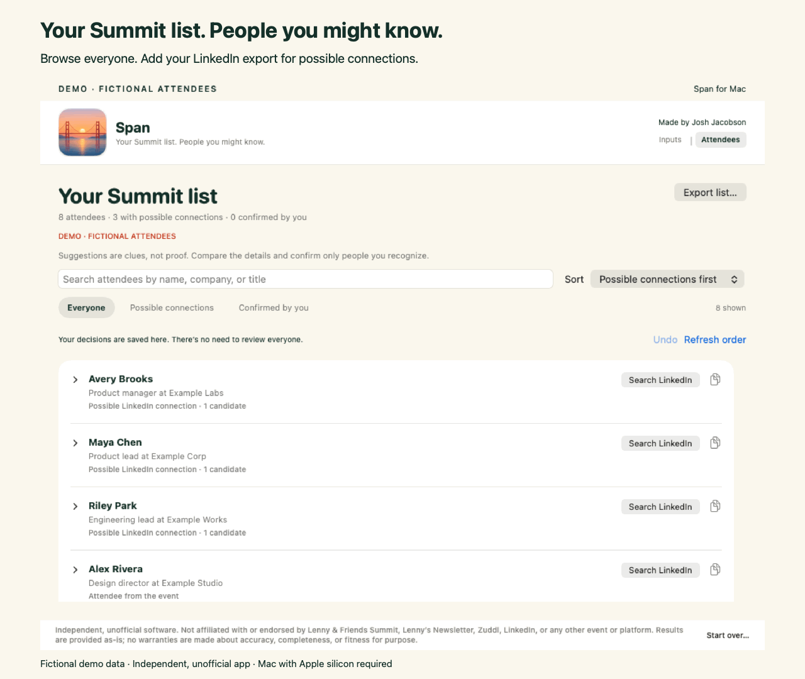

# Span

## Your Summit list. People you might know.

Span is a free Mac app that turns the event’s attendee directory into a useful, searchable desktop list. Add your LinkedIn connections export to highlight people you might already know—then confirm the identity yourself.

### [Download Span for Mac ↓](https://github.com/jmania/span/releases/latest/download/Span-macOS.dmg)

Free · macOS 13+ · Apple silicon (M1 or newer) · Signed and Apple-notarized

Open the download, drag **Span** into **Applications**, then open it there. No GitHub account or coding tools needed. [Step-by-step setup →](docs/getting-started.md)

Watch a short overview (fictional demo data)

[Download the 30-second overview video](Assets/screenshots/Span-overview.mp4)

Made by [Josh Jacobson](https://www.linkedin.com/in/josh--jacobson/) for fellow attendees. Built with help from OpenAI’s GPT-6 Astra in Codex.

**[Releases and downloads](https://github.com/jmania/span/releases) · [Setup guide](docs/getting-started.md) · [Troubleshooting](docs/troubleshooting.md)**

**Release status:** Span 0.5.1 is available. Automated tests and local UI checks passed; an independent second-Mac installation test has not yet been performed. [Release notes](https://github.com/jmania/span/releases/tag/v0.5.1) · [Report a problem](https://github.com/jmania/span/issues)

## What you get

- **A useful attendee list:** search names, companies, and titles immediately after collection.
- **Possible connections, clearly labeled:** compare event details with candidates from your LinkedIn export. A name match is not proof.
- **Useful next steps:** search LinkedIn for any attendee, open a possible connection’s profile when your export includes it, confirm or dismiss the pairing, and export your list.

No mandatory review queue. Nothing is automatically labeled a confirmed connection. “Confirmed by you” means you checked the identity; an absent or dismissed suggestion does not mean you are not connected.

## What you’ll need

| You need | Why |
| --- | --- |
| An Apple-silicon Mac (M1 or newer), running macOS 13 or later | The Lenny & Friends iPhone/iPad app needs Apple silicon to run on a Mac. |
| The Lenny & Friends app installed and signed in | Span reads the attendee list you can access in the event app. |
| Your LinkedIn connections export (optional for browsing) | Adds possible-connection suggestions locally. Request it early; LinkedIn may take time to prepare it. |
| Accessibility permission for Span | This lets Span read and scroll the attendee list. |

No Terminal, coding tools, API key, or LinkedIn login inside Span is required to use the packaged app.

## How it works

1. **Get the guest list.** Open Lenny & Friends → Attendees → All attendees. In Span, allow attendee access and click **Collect attendees**. Keep the event app open while collection runs. Span returns to the beginning and verifies the final count.
2. **Bring your connections.** Request a LinkedIn export containing **Connections**. Drop the downloaded ZIP or `Connections.csv` into Span’s archive box. You can do this before or after collection.
3. **Explore your list.** Open **Attendees**. Possible connections appear directly beneath the attendee’s name and event details. Open a row to compare people; choose **Same person** or **Different person** if you wish. **Open your connection’s profile** refers to the person from your export; **Search LinkedIn for the attendee** searches independently. Rows stay put while you make decisions. Other attendees continue below. Use the small **Search** control (or Command-F) to find someone; **Export list…** is at the bottom.

Collection takes several minutes, especially when the event app starts near the bottom. LinkedIn’s export is a separate wait. [Follow the setup guide →](docs/getting-started.md)

## Your data stays on your Mac

Span processes the attendee list and connections export locally. It has no analytics or cloud account, and it never asks for your LinkedIn password. Opening a LinkedIn search sends that search to LinkedIn in your browser.

The code is shared here; attendee lists, connections archives, and personal results are not. [Privacy and limitations →](docs/privacy.md)

## A small gift to the community

Use it, remix it, improve it. Span’s code is available under the [MIT license](LICENSE). Contributions are welcome—see [Contributing](CONTRIBUTING.md) for where to start.

I built this because I wanted an easier way to find familiar faces at the summit. If it helps, [add me on LinkedIn](https://www.linkedin.com/in/josh--jacobson/) and come say hello.

## For developers

See [Building and releasing Span](docs/development.md). The app is written in Swift and SwiftUI; matching happens locally against the connections export. The current collector reads attendee list cards. It does not open each person’s profile-detail screen or collect every attendee-supplied LinkedIn URL.

## Independent and unofficial

Span is not affiliated with, endorsed by, or sponsored by Lenny & Friends Summit, Lenny’s Newsletter, Zuddl, LinkedIn, or OpenAI. Software and results are provided as-is, without warranties of accuracy, completeness, or fitness for a particular purpose. Names and trademarks belong to their respective owners. See [LICENSE](LICENSE).
