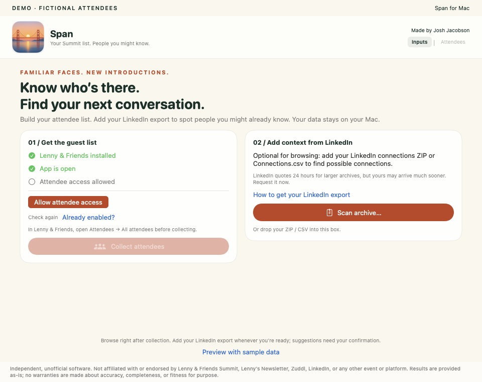

# Get started with Span

Span builds a searchable attendee list and optionally highlights possible connections from your LinkedIn export. Every identity suggestion needs human confirmation. You need an Apple-silicon Mac (M1 or newer) running macOS 13 or later.

**The public installer is being prepared.** Until a signed release appears on the [Releases page](https://github.com/jmania/span/releases), the repository is available for building from source.

## 1. Request your LinkedIn export early (optional for browsing)

In LinkedIn, open **Settings & Privacy → Data privacy → Get a copy of your data** (sometimes labeled **Download your data**). Request an archive containing **Connections**. [LinkedIn’s instructions](https://www.linkedin.com/help/linkedin/answer/a1339364)

LinkedIn says larger archives may take up to 24 hours; yours may arrive sooner. You can collect attendees while waiting. Keep the ZIP when it arrives—you do not need to unzip it.

## 2. Install Span and the event app

Once the public release is available:

1. Open [Span Releases](https://github.com/jmania/span/releases).
2. Download **Span-macOS.dmg** from **Assets**. The “Source code” archives are for developers, not the installer.
3. Open the disk image and drag **Span** to **Applications**.
4. Open Span from Applications.

Install **Lenny & Friends** from the Mac App Store’s iPhone & iPad apps section, sign in with your event account, and open **Attendees → All attendees**. Clear any search or filter. Your event account must already have access to the directory.

## 3. Collect the guest list

1. In Span’s **Get the guest list** box, click **Allow attendee access**.
2. In **System Settings → Privacy & Security → Accessibility**, enable Span. Approve the macOS prompt if one appears.
3. Return to Span and click **Collect attendees**.

Span returns the event list to the beginning before counting. Names appear once the beginning is confirmed. Keep the event app open on All attendees and avoid scrolling or navigating it during collection. Allow several minutes.

**Stop collection** cancels safely. Span verifies its count against the event app’s total; an incomplete scan does not replace a saved list. When it finishes, the input box says **attendees ready**. **Collect attendees again** refreshes the directory without clearing your archive.

## 4. Add your LinkedIn archive

Drop the ZIP or `Connections.csv` into **Add context from LinkedIn**, or click **Scan archive…** and choose it. Span locates the connections file inside a ZIP automatically.

Either input can come first. Matching begins when both are ready. Your archive stays on your Mac.

## 5. Explore your results

- **Summit attendees you may know:** possible connections are shown directly beneath the attendee’s event details, with names and job details from your export. Other attendees continue below.
- **Open a row** to review. **Open your connection’s profile** opens the person from your export—not a verified attendee profile. **Search LinkedIn for the attendee** searches independently using the event details.
- **Same person / Different person:** confirm the identity or dismiss only that pairing. Undo appears within the row. Your decisions never move or remove the attendee. Dismissed suggestions remain available to revisit; right-click a confirmed attendee to remove a confirmation.
- **Search:** use the small Search control or Command-F. Close search or press Escape to return to the full list.
- **Export list…:** at the bottom, export all attendees, clearly separating confirmed profiles from candidate profiles.

Name and company similarity only suggest identities; nothing is confirmed automatically. No suggestion does not mean you are not connected. Profile-detail collection is planned for a later version. Your real inputs and decisions are saved locally; you can quit and return later.

[Troubleshooting](troubleshooting.md) · [Back to Span](../README.md)
